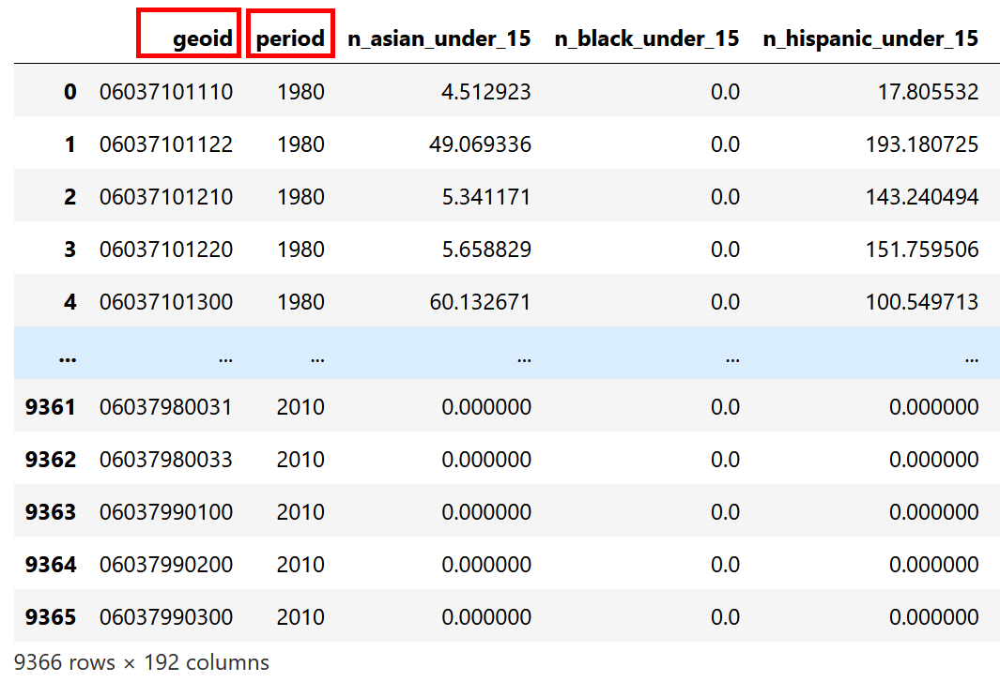

Example Code
===============

.. role:: python(code)
   :language: python

To try our interactive juoyter notebook, please check out our CyberGIS-Vis notebook on CyberGISX platform.

.. link-button:: https://cybergisxhub.cigi.illinois.edu/notebook/recent-advances-in-cybergis-viz-for-democratizing-access-to-scalable-geovisualization/
    :classes: btn-warning text-white font-weight-bold
    :type: url
    :text: Open interactive Notebook on CyberGISX
    :tooltip: Open Jupyter notebook on CyberGISX

Setup Environment
-----------------

.. code-block:: python

        import pandas as pd
        import geopandas as gpd
        from Adaptive_Choropleth_Mapper import Adaptive_Choropleth_Mapper_viz, Adaptive_Choropleth_Mapper_log

Load Data
---------

CyberGIS-Vis requires 2 data files: 
    1. **Attribute data**: your data must contain "geoid" in the first column and the second column must be "period" which is the year of the data. 
    2. **Geometry data**: the geometry data must contain "geoid" in the first column and the second column must be "name" which is the test used to display in the visualization.

Load attribute data from csv file
^^^^^^^^^^^^^^^^^^^^^^^^^^^^^^^^^^

.. code-block:: python
        
        #Load attribute data from csv file
        input_attributes = pd.read_csv("attributes/Los_Angeles_1980_1990_2000_2010.csv", dtype={'geoid':str})
        #Change the column name to "geoid" and "period"
        input_attributes = input_attributes.rename(columns={'geoid': 'geoid', 'year': 'period'})

Load geometry data from shapefile format
^^^^^^^^^^^^^^^^^^^^^^^^^^^^^^^^^^^^^^^^^

.. code-block:: python
        
        #Load geometry from shapefile
        shapefile = gpd.read_file("shp/Los_Angeles_tract/Los_Angeles_2.shp")
        #Change the column name to "geoid" and "name"
        shapefile = shapefile.rename(columns={'tractID': 'geoid', 'tract_key': 'name'})

.. image:: _static/geometry_data_table.png
    :height: 400px
    :alt: geometry data result
    :align: center

Code Samples for the visualization
----------------------------------

Exploring Relationship between data
^^^^^^^^^^^^^^^^^^^^^^^^^^^^^^^^^^^^^^^^^^^^^^^^^^^^^^^^^

1. Scatter Plot
#########################################################

| The chloropleth maps visualize the data of each variable. The data of 2 selected attributes on x-axis and y-axis are visualized in the scatter plot. 

| To show the scatter plot, add the :python:`'Scatter_Plot': True` in the parameter of the :python:`Adaptive_Choropleth_Mapper_viz()`.

.. code-block:: python

        param_Scatter = {
            'title': "Adaptive Choropleth Mapper with Scatter Plot",
            'filename_suffix': "LA_Scatter",
            'inputCSV': input_attributes,   
            'shapefile': shapefile,
            'periods': [2010],
            'shortLabelCSV': "attributes/LTDB_ShortLabel.csv",        
            'variables': [         #enter variable names of the column you entered above.
                "p_nonhisp_white_persons",
                "p_nonhisp_black_persons",
                "p_hispanic_persons",
                "p_asian_persons",
                "p_foreign_born_pop",
                "p_edu_college_greater",
                "p_unemployment_rate",
                "p_employed_manufacturing",
                "p_poverty_rate",
                "p_vacant_housing_units",
                "p_owner_occupied_units",
                "p_housing_units_multiunit_structures",
                "median_home_value",
                "p_structures_30_old",
                "p_household_recent_move",
                "p_persons_under_18",
                "p_persons_over_60",     
            ],
            'InitialLayers':["2010_% edu college greater", "2010_% employed manufacturing" ],
            'Map_width':"470px",
            'Map_height':"450px", 
            'Scatter_Plot': True,  # This is the activate the scatter plot visualization.
        } 
        Adaptive_Choropleth_Mapper_viz(param_Scatter)
        Adaptive_Choropleth_Mapper_log(param_Scatter) 

**Example result**

.. image:: _static/ACM_Scatter.png
    :width: 100%
    :alt: Two chloroplath maps with scatter plot
    :align: center

2. Correlogram
#########################################################

| The chloropleth maps visualize the data of each variable. The correlogram visualizes the scatter plot of all pairs of the selected attributes and the distribution of each selected attributes. 

| To show the scatter plot, add the :python:`'Correlogram': True` in the parameter of the :python:`Adaptive_Choropleth_Mapper_viz()`.

.. code-block:: python

        param_Correlogram = {
            'title': "Adaptive Choropleth Mapper with Correlogram",
            'filename_suffix': "LA_Correlogram",
            'inputCSV': input_attributes,   
            'shapefile': shapefile,
            'NumOfMaps':6,
            'periods': [2010],
            'shortLabelCSV': "attributes/LTDB_ShortLabel.csv",       
            'variables': [         #enter variable names of the column you entered above.
                "p_nonhisp_white_persons",
                "p_nonhisp_black_persons",
                "p_hispanic_persons",
                "p_asian_persons",
                "p_foreign_born_pop",
                "p_edu_college_greater",
                "p_unemployment_rate",
                "p_employed_manufacturing",
                "p_poverty_rate",
                "p_vacant_housing_units",
                "p_owner_occupied_units",
                "p_housing_units_multiunit_structures",
                "median_home_value",
                "p_structures_30_old",
                "p_household_recent_move",
                "p_persons_under_18",
                "p_persons_over_60",     
            ],
            'Map_width':"350px",
            'Map_height':"350px",
            'Correlogram': True, # This is the activate the correlogram visualization.    
        } 
        Adaptive_Choropleth_Mapper_viz(param_Correlogram)
        Adaptive_Choropleth_Mapper_log(param_Correlogram)

**Example result**

.. image:: _static/ACM_Correlogram.png
    :width: 100%
    :alt: four chloroplath maps with correlogram
    :align: center

3. Parallel Coordinate Plot
###############################################################

| The chloropleth maps visualize the data of each variable. The Parallel Coordinate Plot is ideal for comparing many variables together. This type of visualization is used for plotting multivariate, numerical data. The downside is that they can become over-cluttered and therefore illegible when they're very data-dense. 

| To show the Parallel Coordinate Plot, add the :python:`'Correlogram': True` in the parameter of the :python:`Adaptive_Choropleth_Mapper_viz()`.

.. code-block:: python

        param_PCP = {
            'title': "Adaptive Choropleth Mapper with Paralle Coordinate Plot",
            'filename_suffix': "Census_PCP",                                      # max 30 character     
            'inputCSV': input_attributes,   
            'shapefile': shapefile, 
            'periods': [2010],
            'variables': [         #enter variable names of the column you entered above.
                    "p_nonhisp_white_persons",
                    "p_nonhisp_black_persons",
                    "p_hispanic_persons",
                    "p_asian_persons",
                    "p_employed_manufacturing",
                    "p_poverty_rate",
                    "p_foreign_born_pop",
                    "p_persons_under_18",
                    "p_persons_over_60",  
                    "p_edu_college_greater",
                    "p_unemployment_rate",
                    "p_employed_professional",
                    "p_vacant_housing_units",
                    "p_owner_occupied_units",
                    "p_housing_units_multiunit_structures",
                    "median_home_value",
                    "p_structures_30_old",
                    "p_household_recent_move",
            
                ],
            'shortLabelCSV': "attributes/LTDB_ShortLabel.csv",
            'NumOfMaps':4, # Number of chloropleth maps to be displayed.
            'Map_width':"350px",
            'Map_height':"350px",   
            'Parallel_Coordinates_Plot': True,
            'NumOfPCP':6, # number of the attributes to be displayed in the parallel coordinates plot.
            'InitialVariablePCP': ["2010_% white (non-Hispanic)", "2010_% black (non-Hispanic)", "2010_% Hispanic", "2010_% Asian & PI race", "2010_% professional employees", "2010_% manufacturing employees", "2010_% in poverty", "2010_% foreign born", "2010_% 17 and under (total)", "2010_% 60 and older"] # The list of attributes displayed in the parallel coordinates plot.
        }
        Adaptive_Choropleth_Mapper_viz(param_PCP)
        Adaptive_Choropleth_Mapper_log(param_PCP)  

**Example result**

.. image:: _static/ACM_PCP.png
    :width: 100%
    :alt: four chloroplath maps with correlogram
    :align: center

4. Stacked Chart
#########################################################

| The chloropleth maps visualize the data of each period. The stacked chart allows part-to-whole comparisons over time. Data series are stacked one on top of the other in vertical columns. Stacked charts can show change over time because it's easy to compare total column lengths. We reccomend using the stacked chart with only one variable.

| To show the stacked chart, add the :python:`'Stacked_Chart': True` in the parameter of the :python:`Adaptive_Choropleth_Mapper_viz()`. Then, you need to check "Link All" and click "Set Global" to set all maps to the same extent. The stacked chart shows the sum of each class of the selected variable in each period. 

.. code-block:: python

        param_Stacked = {
            'title': "Adaptive Choropleth Mapper with Stacked Chart",
            'filename_suffix': "LA_Stacked",
            'inputCSV': input_attributes,   
            'shapefile': shapefile,
            'periods': [1980, 1990, 2000, 2010],
            'NumOfMaps': 4,
            'shortLabelCSV': "attributes/LTDB_ShortLabel.csv",       
            'variables': [         #enter one variable name of the column you want to display in stacked chart.
                    "p_nonhisp_white_persons", 
            ],
            'Map_width':"350px",
            'Map_height':"350px",    
            'Stacked_Chart': True,  #Add this to display stacked chart in the visualization.       
        }  
        Adaptive_Choropleth_Mapper_viz(param_Stacked)
        Adaptive_Choropleth_Mapper_log(param_Stacked)

**Example result**

The stacked chart is shown the number of unit in each class (8 classes) in each period (1980-2010) of % of non-white population.

.. image:: _static/Qual_Stacked.png
    :width: 100%
    :alt: four chloroplath maps with a stacked chart
    :align: center

5. Top 10 Bar Chart
#########################################################

| The chloropleth maps visualize the data of each attribute. The top 10 bar chart shows the 10 highest values of the selected variable.

| To show the stacked chart, add the :python:`'Top10_Chart': True` in the parameter of the :python:`Adaptive_Choropleth_Mapper_viz()`. 

.. code-block:: python

        param_bar = {
            'title': "Adaptive Choropleth Mapper with Stacked Chart",
            'filename_suffix': "LA_bar",
            'inputCSV': input_attributes,   
            'shapefile': shapefile,
            'periods': [1980, 1990, 2000, 2010],
            'NumOfMaps': 3,
            'shortLabelCSV': "attributes/LTDB_ShortLabel.csv",      
            'variables': [                 
                "p_other_language",
                "p_female_headed_families",
                "per_capita_income",     
            ],
            'Top10_Chart': True,  #Add this to display tyop 10 bar chart in the visualization.             
        }  
        Adaptive_Choropleth_Mapper_viz(param_bar)
        Adaptive_Choropleth_Mapper_log(param_bar)

**Example result**

.. image:: _static/Qual_top10.png
    :width: 100%
    :alt: three chloroplath maps with a top 10 bar chart
    :align: center

Visualizations for Spatiotemporal Data
^^^^^^^^^^^^^^^^^^^^^^^^^^^^^^^^^^^^^^^^^

1. Multiple Line Chart (MLC)
#########################################################

| The chloropleth maps visualize the data of each attribute. The multiple line chart shows the line charts of the selected attributes.

| To show the stacked chart, add the :python:`'Multiple_Line_Chart': True` in the parameter of the :python:`Adaptive_Choropleth_Mapper_viz()`. 

| You can customize the line chart by adding the following arguments:

- :python:`NumOfMLC` to specify number of line chart to be shown
- :python:`titlesOfMLC` to specify the title of each line chart
- :python:`DefaultRegion_MLC` to specify the default region for each line chart

.. code-block:: python

        param_MLC_COVID = {
            'title': "Covid-19 Risk Assessment using Twitter, Metropolitan Statistical Areas, USA",
            'Subject': "Temporal Patterns",
            'filename_suffix': "COVID_MLC",  # max 30 character      
            'inputCSV': Covid_Visits,   
            'shapefile': shapefile_MSA, 
            'periods': "All",
            'variables': [         #enter variable names of the column you entered above.
                    "Confirmed Rate",
                    "Death Rate",
                    "The Number of Visits from Outside to Inside of the selected MSA"
                ],
            'NumOfMaps':2,
            'InitialLayers':["2020-03-15_Confirmed Rate" , "2020-12-27_Confirmed Rate"],
            'Initial_map_center':[37, -97],
            'Initial_map_zoom_level':4,    
            'Map_width':"650px",
            'Map_height':"400px", 
            'Top10_Chart': True,     
            'Multiple_Line_Chart': True,
            'NumOfMLC':3,
            'titlesOfMLC':["1. COVID-19 Confirmed Cases (/100k pop)", "2. COVID-19 Death Cases (/100k pop)", "3. The Number of Visits from Outside to Inside of the selected MSA"],
            'DefaultRegion_MLC':"35620" 
        }
        Adaptive_Choropleth_Mapper_viz(param_MLC_COVID)
        Adaptive_Choropleth_Mapper_log(param_MLC_COVID)

**Example result**

.. image:: _static/ACM_MLC.png
    :width: 100%
    :alt: three chloroplath maps with Multiple Line Chart
    :align: center

2. Comparison Line Chart (CLC)
#########################################################

| The chloropleth maps visualize the data of each attribute. The top 10 bar chart shows the 10 highest values of the selected variable.

| To show the stacked chart, add the :python:`'Comparision_Chart': True` in the parameter of the :python:`Adaptive_Choropleth_Mapper_viz()`. 

| You can customize the line chart by adding the following arguments:

- :python:`NumOfCLC` is the number of values on the X-axis of CLC
- :python:`DefaultRegion_CLC` to specify 2 default regions for the visualization

.. code-block:: python

        param_CLC_COVID = {
            'title': "Comparison of COVID-19 Confirmed Rate between Metropolitan Statistical Areas, USA",
            'Subject': "Temporal Patterns",
            'filename_suffix': "COVID_CLC",                                      # max 30 character      
            'inputCSV': Covid_Visits,   
            'shapefile': shapefile_MSA, 
            'periods': "All",
            'variables': [         #enter variable names of the column you entered above.
                    "Confirmed Rate"
                ],
            'NumOfMaps':2,
            'InitialLayers':["2020-04-19_Confirmed Rate" , "2020-11-01_Confirmed Rate"],
            'Initial_map_center':[37, -97],
            'Initial_map_zoom_level':4,    
            'Map_width':"650px",
            'Map_height':"400px",     
            'Top10_Chart': True,     
            'Comparision_Chart': True,
            'NumOfCLC': 46,
            'DefaultRegion_CLC': ["35620", "16980"] 
        }
        Adaptive_Choropleth_Mapper_viz(param_CLC_COVID)
        Adaptive_Choropleth_Mapper_log(param_CLC_COVID)  

**Example result**

.. image:: _static/ACM_CLC.png
    :width: 100%
    :alt: three chloroplath maps with  Comparison Line Chart
    :align: center

|

.. link-button:: https://cybergisxhub.cigi.illinois.edu/notebook/recent-advances-in-cybergis-viz-for-democratizing-access-to-scalable-geovisualization/
    :classes: btn-warning text-white font-weight-bold
    :type: url
    :text: Open interactive Notebook on CyberGISX
    :tooltip: Open Jupyter notebook on CyberGISX